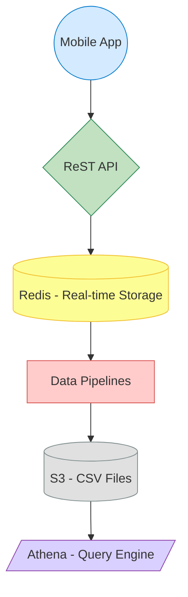

```mermaid
flowchart TD
    A((Mobile App)) --> B{ReST API}
    B --> C[("Redis - Real-time Storage")]
    C --> D["Data Pipelines"]
    D --> E[("S3 - CSV Files")]
    E --> F[/"Athena - Query Engine"/]

    style A fill:#d4eaff,stroke:#007acc
    style B fill:#c1e1c1,stroke:#2e8b57
    style C fill:#fdfd96,stroke:#f1c232
    style D fill:#ffcccb,stroke:#d9534f
    style E fill:#e0e0e0,stroke:#7f8c8d
    style F fill:#dad0ff,stroke:#8e44ad

    click A href "https://developer.apple.com/design/human-interface-guidelines/workouts" _blank
    click E href "https://us-west-1.console.aws.amazon.com/s3/buckets/csai381-data" _blank
```
