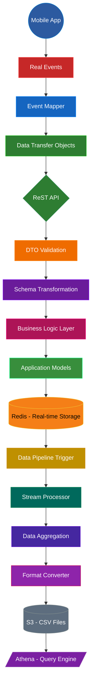

```mermaid
flowchart TD
    %% Mobile App Flow
    A((Mobile App)) --> A1[Real Events]
    A1 --> A2[Event Mapper]
    A2 --> A3[Data Transfer Objects]
    A3 --> B{ReST API}
    
    %% ReST API Complex Schema Processing
    B --> B1[DTO Validation]
    B1 --> B2[Schema Transformation]
    B2 --> B3[Business Logic Layer]
    B3 --> B4[Application Models]
    B4 --> C[("Redis - Real-time Storage")]
    
    %% Separate Pipeline Flow
    C --> P1[Data Pipeline Trigger]
    P1 --> P2[Stream Processor]
    P2 --> P3[Data Aggregation]
    P3 --> P4[Format Converter]
    P4 --> E[("S3 - CSV Files")]
    E --> F[/"Athena - Query Engine"/]
    
    %% Styling
    style A fill:#2c5aa0,stroke:#007acc,color:#ffffff
    style B fill:#2e7d32,stroke:#2e8b57,color:#ffffff
    style C fill:#f57f17,stroke:#f1c232,color:#000000
    style E fill:#5d6d7e,stroke:#7f8c8d,color:#ffffff
    style F fill:#7b1fa2,stroke:#8e44ad,color:#ffffff
    
    %% Transformation stages styling
    style A1 fill:#c62828,stroke:#ff4d4d,color:#ffffff
    style A2 fill:#1565c0,stroke:#0080ff,color:#ffffff
    style A3 fill:#2e7d32,stroke:#00b300,color:#ffffff
    style B1 fill:#ef6c00,stroke:#ff8000,color:#ffffff
    style B2 fill:#6a1b9a,stroke:#8000ff,color:#ffffff
    style B3 fill:#ad1457,stroke:#ff0080,color:#ffffff
    style B4 fill:#388e3c,stroke:#00ff80,color:#ffffff
    
    %% Pipeline styling
    style P1 fill:#bf9000,stroke:#cc8800,color:#ffffff
    style P2 fill:#00695c,stroke:#008855,color:#ffffff
    style P3 fill:#4527a0,stroke:#5500cc,color:#ffffff
    style P4 fill:#8e24aa,stroke:#cc0055,color:#ffffff

    click A href "https://developer.apple.com/design/human-interface-guidelines/workouts" _blank
    click E href "https://us-west-1.console.aws.amazon.com/s3/buckets/csai381-data" _blank
```
